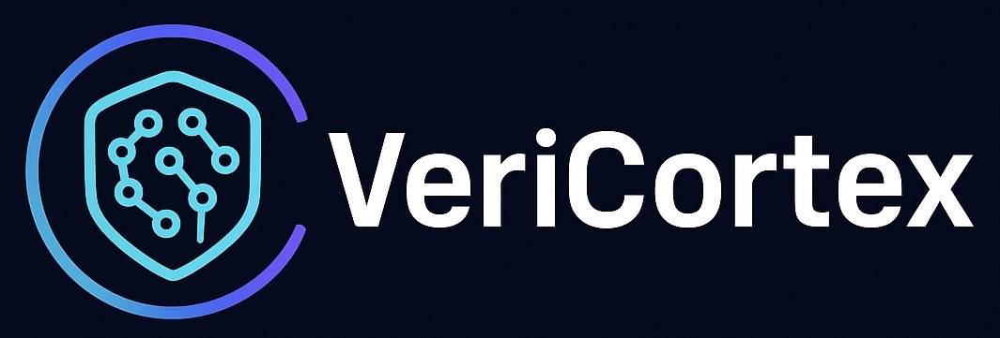

  

## 🧠 VeriCortex  
**Trust Layer for AI — Verifiable Intelligence on BlockDAG**

veriCortex is a **modular AI verification and trust framework** designed to run on **BlockDAG** networks.  
It enables applications to **prove AI outputs**, **secure autonomous agents**, and **build verifiable compute pipelines**.

We bring **cryptographic trust to AI** by validating computation proofs, inference attestations, and execution integrity signals.

Whether AI is running locally, in the cloud, within smart agent swarms, or across decentralized compute networks —  
**VeriCortex allows users to verify what really happened, not just trust claims.**

---

## 🎯 Mission
To make **AI provable, trustworthy, and censorship-resistant** — enabling secure autonomous systems and transparent on-chain intelligence.

---

## 🧩 Key Concepts

| Concept | Description |
|----------|--------------|
| **Verifiable AI** | Confirm AI outputs are correct &amp; untampered |
| **AI Proof Layer** | Verify proofs of execution &amp; inference integrity |
| **On-chain Verifier** | Minimal smart-contract verifier on BlockDAG |
| **Off-chain Runtime** | Secure WASM execution &amp; proof pipeline |
| **Proof Adaptors** | Supports cryptographic proofs &amp; attestations |

---

## 🛠️ Overview
veriCortex bridges **AI computation** and **decentralized trust layers** by providing:
- Proofs of AI inference integrity  
- Verifiable execution across distributed nodes  
- Compatibility with cryptographic proof systems and attestations  
- Extensible adaptors for on-chain and off-chain environments  

---

## 🌐 Vision
To empower a new generation of **provable AI systems** where:
- Outputs can be **verified** instead of **assumed**  
- AI agents are **accountable**, **transparent**, and **trust-minimized**  
- The infrastructure for intelligence is **open**, **secure**, and **censorship-resistant**

---

### 🤝 Contributing
We welcome contributions from developers, researchers, and builders in AI, cryptography, and decentralized systems.  
Stay tuned for contribution guidelines and module specifications.

---

**veriCortex — Making AI Verifiable.**
