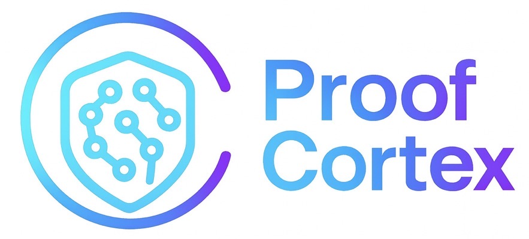
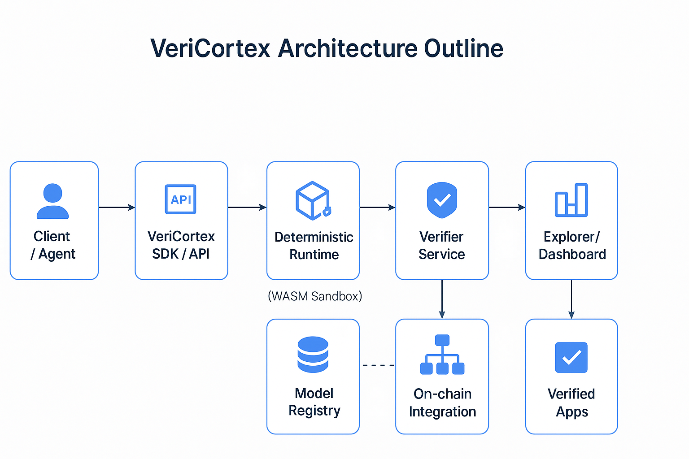

  <picture>
  <source media="(prefers-color-scheme: dark)" srcset="assets/IMG_0950.jpeg">
  <source media="(prefers-color-scheme: light)" srcset="assets/IMG_0950.jpeg">
  
</picture>

**Trust Layer for AI — Verifiable Intelligence on BlockDAG**

> **⚠️ Project Notice:**
> This project is being renamed to **ProofCortex**. ProofCortex and ProofCortex names are being used interchangebly.

ProofCortex is a **modular AI verification and trust framework** designed to run first on **BlockDAG** networks.  
It enables applications to **prove AI outputs**, **secure autonomous agents**, and **build verifiable compute pipelines**.

We bring **cryptographic trust to AI** by validating computation proofs, inference attestations, and execution integrity signals.

Whether AI is running locally, in the cloud, within smart agent swarms, or across decentralized compute networks —  
**VeriCortex allows users to verify what really happened, not just trust claims.**

> Visit the full documentation at [**ProofCortex Wiki →**](https://github.com/veeringman/veriCortex/wiki)

---

## Mission
To make **AI provable, trustworthy, and censorship-resistant** — enabling secure autonomous systems and transparent on-chain intelligence.

---

## Key Concepts

| Concept | Description |
|----------|--------------|
| **Verifiable AI** | Confirm AI outputs are correct &amp; untampered |
| **AI Proof Layer** | Verify proofs of execution &amp; inference integrity |
| **On-chain Verifier** | Minimal smart-contract verifier on BlockDAG |
| **Off-chain Runtime** | Secure WASM execution &amp; proof pipeline |
| **Proof Adaptors** | Supports cryptographic proofs &amp; attestations |

---

## Overview
ProofCortex bridges **AI computation** and **decentralized trust layers** by providing:
- Proofs of AI inference integrity  
- Verifiable execution across distributed nodes  
- Compatibility with cryptographic proof systems and attestations  
- Extensible adaptors for on-chain and off-chain environments  

---

## Vision
To empower a new generation of **provable AI systems** where:
- Outputs can be **verified** instead of **assumed**  
- AI agents are **accountable**, **transparent**, and **trust-minimized**  
- The infrastructure for intelligence is **open**, **secure**, and **censorship-resistant**

---
## Who ProofCortex Is For

ProofCortex is designed for teams and ecosystems that rely on **trust, auditability, and transparency in AI**:

- **AI/ML Product Teams** – needing verifiable, deterministic model outputs for deployment and compliance.  
- **Enterprises & Regulated Sectors** – BFSI, healthcare, insurance, telecom, and government systems requiring auditable AI decisions.  
- **Web3 dApps & Agent Frameworks** – integrating AI inference with on-chain proof verification for trustless automation.  
- **Security, Risk & Compliance Teams** – validating AI pipeline integrity, preventing tampering, and ensuring traceability.  
- **Platform & Tooling Builders** – creating SDKs, agent systems, or inference platforms that require interoperable verification rails.

---
## Why BlockDAG for ProofCortex?

Traditional blockchains are sequential — every block must wait for the previous one to finalize.  
This linear structure introduces **latency**, **bottlenecks**, and **limited parallelism**, making them unsuitable for **real-time AI verification** and **distributed inference proofs**.

**BlockDAG (Directed Acyclic Graph-based architecture)** changes that.

---

### Why it’s the perfect foundation for VeriCortex

| **Challenge** | **How BlockDAG Solves It** | **Impact on VeriCortex** |
|----------------|----------------------------|---------------------------|
| **Sequential validation in L1 chains** | Parallel block propagation and DAG-based finality | Enables high-throughput proof verification |
| **Limited concurrency for proof submissions** | DAG allows multiple proofs to be appended asynchronously | Many models or nodes can submit proofs in real-time |
| **Network latency during validation** | Blocks don’t compete for a single head — they co-exist | Reduces latency for inference confirmations |
| **Scalability constraints** | BlockDAG scales horizontally with node count | Supports massive AI inference traffic |
| **Security-trust gap for off-chain AI** | DAG topology maintains verifiable ordering of computation | Guarantees integrity between inference & proof submission |

---

### In VeriCortex Context

In the **VeriCortex ecosystem**, BlockDAG acts as the **trust backbone** for the Proof-of-Inference (PoI) layer:

1. **Off-chain runtimes** (WASM warm pools) execute AI inference deterministically.  
2. **Proofs** of these inferences (e.g., ZK or crypto attestations) are generated.  
3. **Verifier nodes** anchored on the BlockDAG validate and timestamp these proofs in parallel.  
4. Multiple verifiers can commit results without waiting on a single chain head — ensuring real-time trust for decentralized AI.

VeriCortex doesn’t just record computation — it *proves* it.  
BlockDAG provides the **parallel, verifiable, and low-latency substrate** needed to make proof-based AI verifiable **at scale**.

> **In essence:**  
> 🕸️ **BlockDAG = Proof Infrastructure for the AI Age.**

---

## Architecture Outline

The **VeriCortex architecture** is designed to bridge the gap between *AI inference* and *on-chain verifiability*.  
It leverages a **modular, scalable pipeline** that ensures deterministic execution, trace generation, and proof verification — all anchored on the **BlockDAG network**.

The architecture can be viewed in three main layers:

### 1. Off-Chain AI Runtime
- Executes inference tasks deterministically using WASM-based isolated environments.
- Captures execution traces and generates cryptographic or ZK proofs of correctness.
- Interfaces with the VeriCortex API for job orchestration and proof submission.

### 2. Verification Layer (On-Chain)
- Receives proofs from off-chain nodes and validates them via verifier smart agents.
- Anchors results onto the BlockDAG ledger, maintaining causal ordering.
- Supports concurrent submissions, minimizing latency and maximizing throughput.

### 3. Access & Integration Layer
- Provides APIs, SDKs, and dashboard explorers for dApps, agents, and model registries.
- Enables seamless integration into decentralized applications or data markets.
- Displays verified inference activity in real-time through the Explorer interface.

---

### VeriCortex System Architecture

Below is the architecture schematic illustrating the data flow across these layers:

  

---
### Key Highlights

- **Parallel proof verification** through BlockDAG concurrency  
- **Deterministic execution trace capture** via WASM runtimes  
- **Composable APIs** for model developers and inference agents  
- **Secure audit trail** with cryptographic proof anchoring  
- **Future-ready scalability** for AI x Blockchain ecosystems  

---
## Post-Buildathon Roadmap

After the Buildathon submission, VeriCortex will transition from a functional prototype into a production-grade, multi-layer verification stack. The following roadmap outlines the key phases:

### **1. Expand Deterministic Runtime (WASM)**
- Integrate multi-model support (LLMs, vision, tabular models).  
- Add optimized execution layers with caching, SIMD, and sandboxing.  
- Introduce multi-language WASM bindings (Python, JS, Rust).

### **2. Full Verifier Engine (Off-Chain & On-Chain)**
- Upgrade proof format to support richer trace checkpoints.  
- Integrate SNARK/STARK proof experiments for long-term trustlessness.  
- Add multi-chain compatibility beyond BlockDAG (EVM & non-EVM).

### **3. Build Developer Tools & SDK Ecosystem**
- Release fully documented SDKs for JS/TS, Rust, Python, Go.  
- Provide templates for dApps, backend services, and AI agents.  
- Add automated CI workflows for verification workflows.

### **4. Expanding API Platform**
- Hosted API for model registration, verification pipelines, and proof retrieval.  
- Tiered access: free tier (open verification), enterprise tier (SLA, audit mode).  
- Telemetry & analytics dashboard for usage insights.

### **5. Model Registry & Trust Layer**
- Support model versioning, provenance, and supply-chain metadata.  
- Add permissioned vs public registry options.  
- Optional encryption layer for confidential model verification.

### **6. Productization & Enterprise Integration**
- Plugins for existing AI stacks:  
  - LangChain / LlamaIndex  
  - Kubernetes & serverless backends  
  - MLOps platforms (MLflow, Sagemaker, Vertex AI)  
- Compliance toolkit (GDPR, RBI guidelines, HIPAA-ready logs).  

### **7. Community & Ecosystem Growth**
- Open-source governance model.  
- Community challenges for building verified AI agents.  
- Integration with the broader BlockDAG ecosystem (DEX tools, bridges, infra).

### **8. Move Toward Full Layer-1 Design Exploration**
- Experiment with a dedicated execution layer optimized for verifiable compute.  
- Study hybrid rollup + DAG-ordering models.  
- Prototype a domain-specific L1/rollup built for deterministic AI execution.

This roadmap ensures VeriCortex grows from a Buildathon showcase into a complete **Verifiable AI Infrastructure Layer** powering trust in decentralized and traditional systems.

---

## Contributing
We welcome contributions from developers, researchers, and builders in AI, cryptography, and decentralized systems.  
Stay tuned for contribution guidelines and module specifications.

---
*VeriCortex — Making AI Verifiable.*
---
